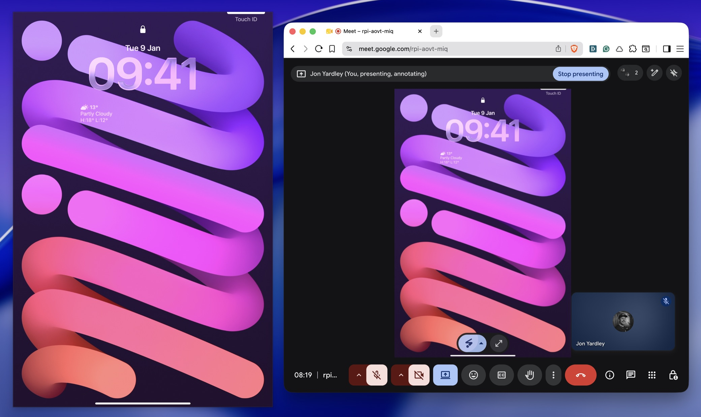
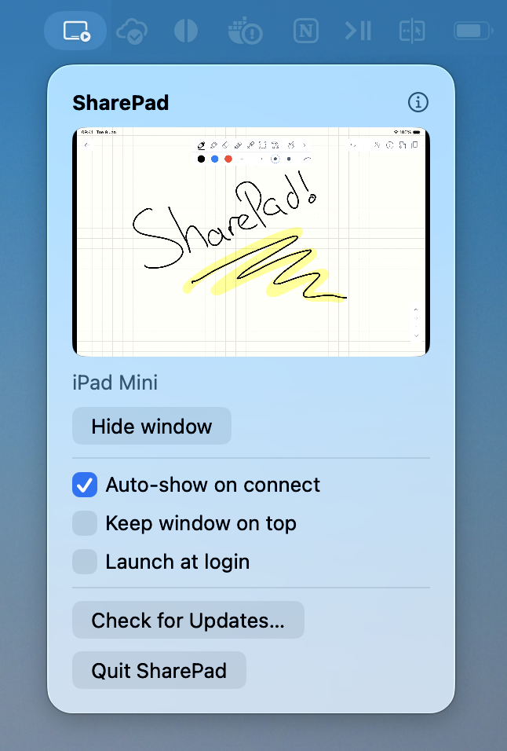

# SharePad

[](https://github.com/jonyardley/SharePad/actions/workflows/ci.yml)
[](https://sharepad.co)

<p align="center">
  
  <br />
  <em>SharePad on the left; the same window shared into Google Meet at full size on the right.</em>
</p>

A macOS **menu-bar app** that turns a USB-connected iPad into a **live
whiteboard** you can share in any video call. Connect it to your Mac and it shows
up as a clean, aspect-locked window — already waiting in the "Share window" list
of Zoom, Meet, and Teams. **Share your thinking, not just your screen** — without
the per-call QuickTime faff.

Primary use case: live drawing / whiteboarding, shared full-size as a proper
window.

<p align="center">
  
  <br />
  <em>The whole app — a menu-bar popover with a live preview and the controls a click away.</em>
</p>

> **Status: shipping — 7-day free trial + one-time licence.** Signed, notarised,
> and auto-updating. Download free from [sharepad.co](https://sharepad.co) and try
> it for 7 days; after that a one-time **£6.99 licence** (works offline, no account,
> no subscription, updates for life) keeps it running. Already bought? Recover your
> key in the app — you won't be charged again. Or build it yourself (GPLv3,
> instructions below). App Store is ruled out — its sandbox breaks the CMIO opt-in
> the capture depends on.

## Docs

- **[DESIGN.md](DESIGN.md)** — comprehensive design spec: problem, architecture,
  state machine, the verified AVFoundation/CoreMediaIO capture foundation,
  milestones, edge cases, open questions. Source of truth.
- **[CLAUDE.md](CLAUDE.md)** — development guidelines: conventions,
  non-negotiables, gotchas, tier workflow.

## Build

```bash
brew install xcodegen just swiftformat swiftlint
just run        # generate the Xcode project, build, and launch the menu-bar app
```

Run `just` for all recipes (`gen`, `build`, `run`, `open`, `fmt`, `lint`, `test`).
The Xcode project is generated by xcodegen and git-ignored — edit `project.yml`,
never the `.xcodeproj`.

### Release (Developer ID, notarized)

`just release-build` produces a Hardened-Runtime Release build (ad-hoc signed —
enough to test locally). `just release` runs the full pipeline (build → Developer
ID sign → notarize → DMG); it needs a signing identity and an App Store Connect
API key supplied via environment variables (see [`specs/distribution.md`](specs/distribution.md)).
CI runs this automatically on a `v*` tag via `.github/workflows/release.yml`.

## Approach

Window-share, **not** a virtual camera — for live drawing, full shared content
beats a small webcam tile. See
[DESIGN.md §2](DESIGN.md#2-approach--rejected-alternatives) for the trade-off.

## License

SharePad is free and open source under the [GNU GPLv3](LICENSE). You're welcome to
build it yourself from source. Or download the signed, notarised, auto-updating
build and **[try it free for 7 days](https://sharepad.co)**; after that a one-time
**£6.99 licence** (works offline, no account, no subscription, updates for life)
keeps it going — the easiest way to get SharePad and the best way to support its
development.
