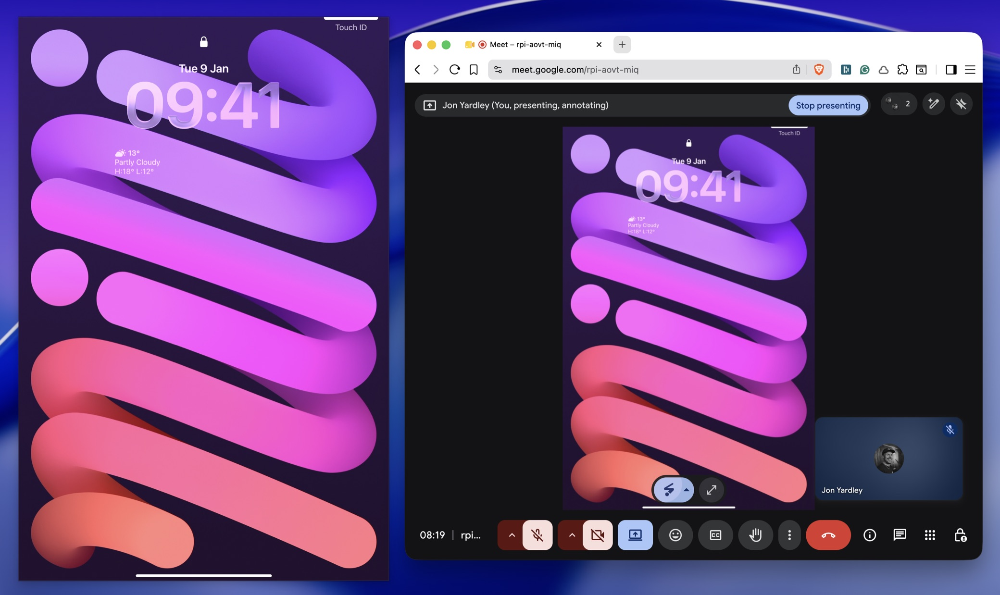
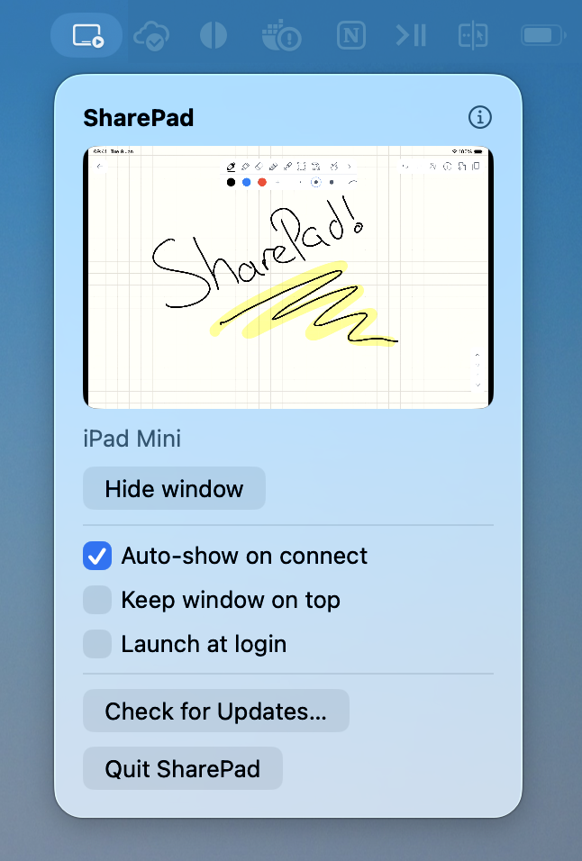

# SharePad

[](https://github.com/jonyardley/SharePad/actions/workflows/ci.yml)
[](https://sharepad.co)

<p align="center">
  
  <br />
  <em>SharePad on the left; the same window shared into Google Meet at full size on the right.</em>
</p>

A macOS **menu-bar app** that shows a USB-connected iPad in a clean window you
can share in any video call. Draw in your favourite app and everyone sees it full
size. Connect the iPad to your Mac and its window is already waiting in the
"Share window" list of Zoom, Meet and Teams. **Share your thinking, not just your
screen**, without the per-call QuickTime faff.

<p align="center">
  
  <br />
  <em>The menu-bar popover: a live preview and every control in one place.</em>
</p>

> Download it from [sharepad.co](https://sharepad.co) and try it free for 7 days.
> After that it's **£2.99 once**: no subscription, no account, and the licence works
> offline. Already bought it? Click "Lost your key?" in the app and I'll email it
> again. Or build it yourself (GPLv3, instructions below). It isn't on the App Store
> because the App Store sandbox stops macOS treating the iPad as a camera.

## Docs

- **[DESIGN.md](DESIGN.md)**: comprehensive design spec: problem, architecture,
  state machine, the verified AVFoundation/CoreMediaIO capture foundation,
  milestones, edge cases, open questions. Source of truth.
- **[CLAUDE.md](CLAUDE.md)**: development guidelines: conventions,
  non-negotiables, gotchas, tier workflow.

## Build

```bash
brew install xcodegen just swiftformat swiftlint
just run        # generate the Xcode project, build, and launch the menu-bar app
```

Run `just` for all recipes (`gen`, `build`, `run`, `open`, `fmt`, `lint`, `test`).
The Xcode project is generated by xcodegen and git-ignored. Edit `project.yml`,
never the `.xcodeproj`.

### Release (Developer ID, notarised)

`just release-build` produces a Hardened-Runtime Release build (ad-hoc signed,
enough to test locally). `just release` runs the full pipeline (build → Developer
ID sign → notarise → DMG); it needs a signing identity and an App Store Connect
API key supplied via environment variables (see [`specs/distribution.md`](specs/distribution.md)).
CI runs this automatically on a `v*` tag via `.github/workflows/release.yml`.

## Approach

Window-share, **not** a virtual camera: for live drawing, full shared content
beats a small webcam tile. See
[DESIGN.md §2](DESIGN.md#2-approach--rejected-alternatives) for the trade-off.

## Licence

SharePad is free and open source under the [GNU GPLv3](LICENSE). You're welcome to
build it yourself from source. Or download the signed, notarised, auto-updating
build and **[try it free for 7 days](https://sharepad.co)**; after that a one-time
**£2.99 licence** (works offline, no account, no subscription, updates for life)
keeps it going. It's the easiest way to get SharePad, and it pays for my time on it.
